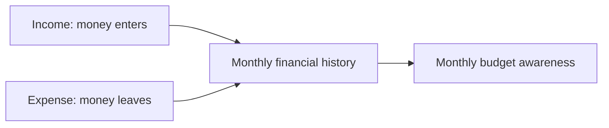
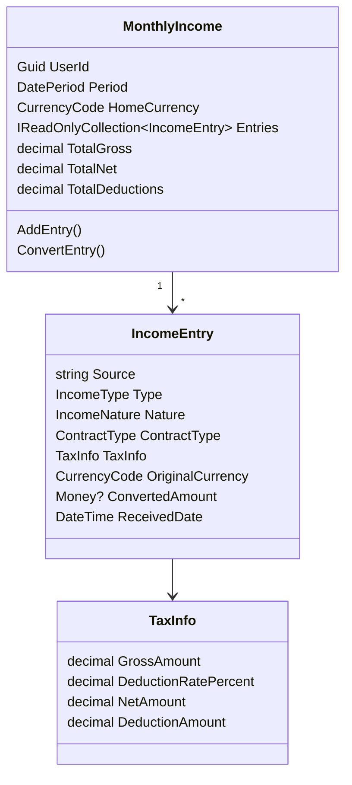
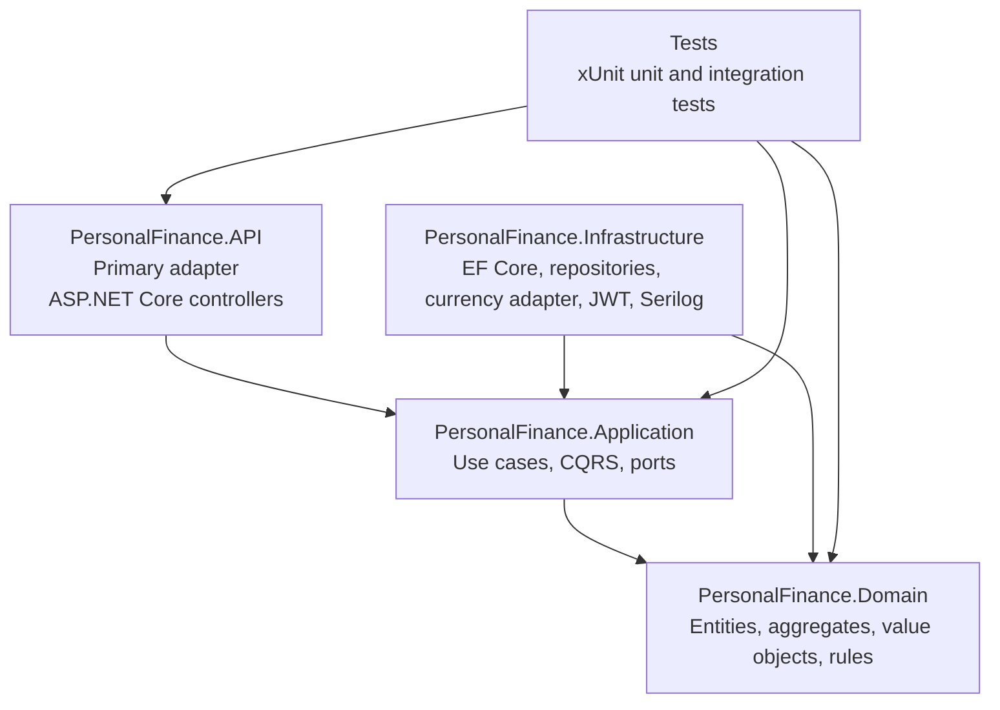
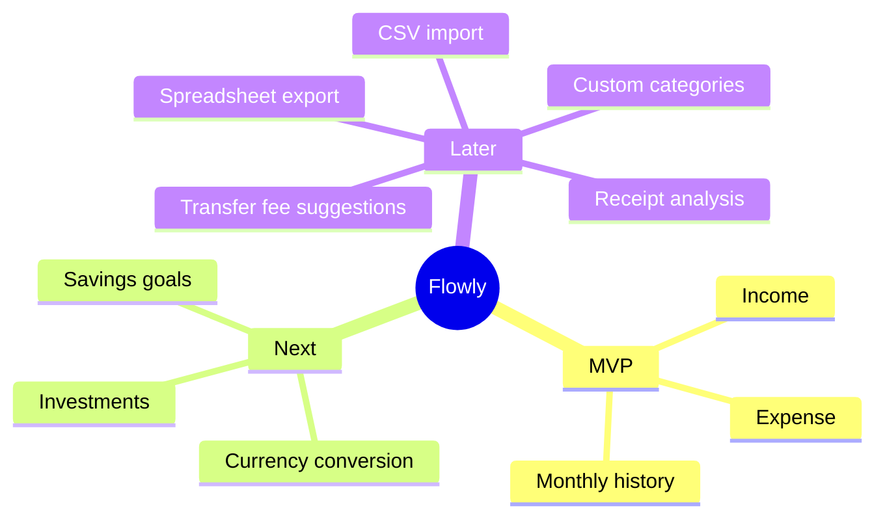

# Flowly

Flowly is a personal finance app designed for people with no financial background. It helps users build healthy money habits, manage monthly budgets, and stay in control of their finances through a simple and friendly experience.

The project is being Domain-first architecture: business rules are validated before infrastructure is added into a domain-first .NET application. The priority right now is not infrastructure or database work. The priority is understanding the domain correctly and protecting the core business rules with tests.

## Product Vision

Flowly exists to help people answer simple but important money questions:

- Where does my money come from?
- How much did I receive?
- When did I receive it?
- Where did my money go?
- How much money remains for the month?

The MVP is intentionally simple:

> Money enters and money leaves.

That means the first useful version focuses on income, expenses, and monthly financial history. Savings, investments, currency conversion, receipt analysis, spreadsheet import/export, and financial suggestions are part of the future direction, but the foundation starts with cash flow.

## Current Focus

The current domain focus is Income, because income is the starting point for monthly financial history. Expense is also part of the core idea, but Income is being shaped first so the app can correctly represent what the user earns before it explains what the user spends.



## Income Domain

Income answers three questions:

- Where did the money come from?
- How much money was received?
- When was it received?

`MonthlyIncome` represents one user's income for one month. It contains multiple `IncomeEntry` records, such as salary, bonus, freelance work, rental income, dividends, or interest.



### Income Classification

Flowly separates the specific income type from the income nature.

`IncomeType` explains what the source is:

- Salary
- Bonus
- Prima
- Freelance
- International freelance
- Rental
- Dividend
- Interest
- Other

`IncomeNature` explains whether the money came from direct work or from an asset:

- Active: salary, bonus, prima, freelance, international freelance, extra work
- Passive: rental income, dividends, interest, investment returns

This is the current default behavior. In the future, users should be able to customize categories and labels to match their own financial life.

## Business Rules

| Rule | Meaning | Current implementation |
| --- | --- | --- |
| I1 | A month can have many income sources besides the main salary. | `MonthlyIncome.AddEntry()` supports multiple entries. |
| I2 | Gross and net income must be represented clearly. | `TaxInfo` stores gross amount and deduction rate, and calculates net amount. |
| I3 | Income values cannot be negative. | `Money` and `TaxInfo` reject negative values. |
| I4 | Bonus or prima is active income. | `IncomeType.Bonus` and `IncomeType.Prima` map to `IncomeNature.Active`. |
| I5 | Extra or freelance work is active income. | `IncomeType.Freelance` and `IncomeType.InternationalFreelance` map to `IncomeNature.Active`. |
| I6 | Income can be received in another currency. | `CurrencyCode`, `ICurrencyConverter`, and conversion support exist. |

## Architecture

Flowly uses Clean Architecture / Hexagonal Architecture with DDD concepts. The domain owns the business language. The application layer coordinates use cases. Infrastructure implements external details such as persistence, currency adapters, logging, and security.



## Project Structure

```text
PersonalFinance/
  src/
    PersonalFinance.Domain
      Common/Primitives
      Common/ValueObjects
      Income
      Expense
      Savings
      Investment

    PersonalFinance.Application
      Common/Interfaces
      Common/Behaviors
      Income/Commands
      Income/Queries
      Income/Ports

    PersonalFinance.Infrastructure
      Persistence
      Adapters/Currency
      Adapters/Identity
      Logging
      Security

    PersonalFinance.API
      Controllers
      Middleware
      Extensions

  tests/
    PersonalFinance.UnitTests
    PersonalFinance.IntegrationTests
```

## Technical Direction

The project targets:

- .NET 10
- DDD
- TDD
- Clean Architecture / Hexagonal Architecture
- EF Core and LINQ
- CORS handled explicitly
- OWASP Top 10 awareness from the beginning

The repository layer exists, and EF Core configuration is present, but the project is currently domain-first. Database design should follow the domain instead of forcing the domain to match storage concerns too early.

## Security Direction

Security is part of the foundation, not something added at the end.

Current security concerns include:

- CORS policies
- JWT authentication
- secure response headers
- centralized exception handling
- structured logging
- avoiding raw SQL and relying on EF Core parameterized queries

## Future Ideas

Flowly can grow into a practical personal finance assistant.

Potential future features:

- Currency conversion for users paid in USD, COP, MXN, EUR, or other currencies.
- Receipt or screenshot upload to detect expense amount and category.
- CSV and spreadsheet import/export.
- Suggestions about hidden transfer fees.
- Better transfer route recommendations.
- User-defined income and expense categories.
- Savings goals such as emergency funds, travel, or planned purchases.
- Investment tracking such as CDTs or long-term savings.



## Development

Run the full test suite:

```bash
dotnet test PersonalFinance.sln
```

Run the API:

```bash
dotnet run --project src/PersonalFinance.API
```

The current verified state:

- Unit tests passing
- Initial API integration smoke test passing
- Income active/passive classification covered by tests
